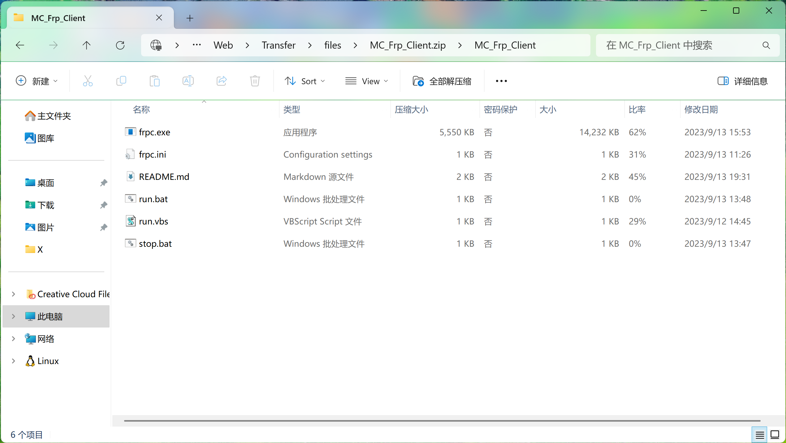
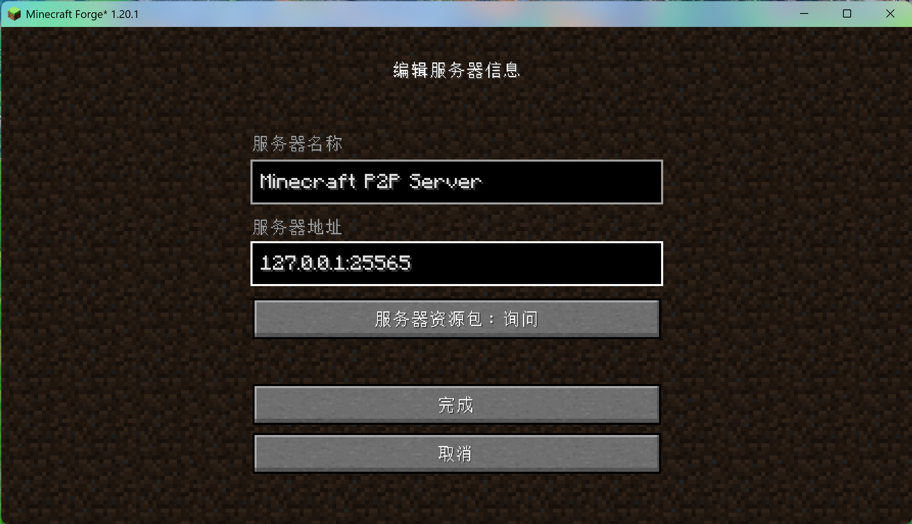
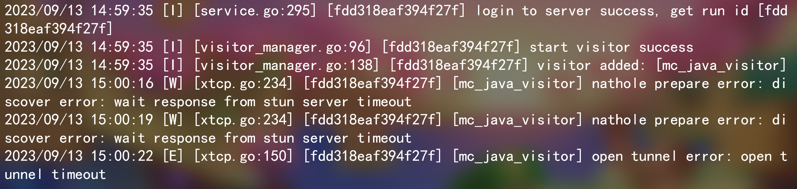
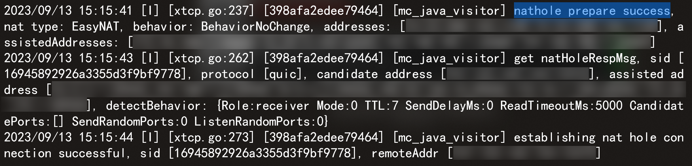
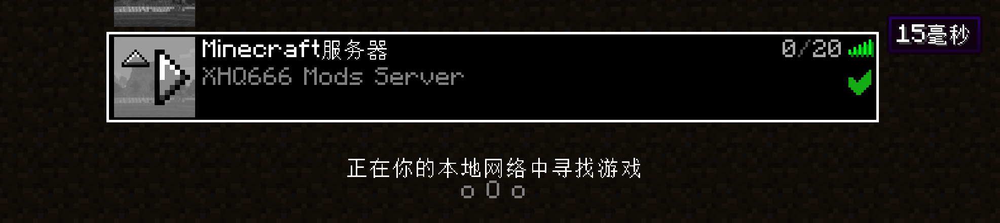

# Frp Client 使用文档

### [点击转到 Releases 下载](https://github.com/XHQ6666/MC_Server/releases)

### 下载压缩包后解压 MC_Frp_Client 文件夹

### 以下是各个文件用途

### frpc.exe

Frp Client 可执行文件
### frpc.ini

Frp Client 的配置文件，若配置有更新将会通知你更新

注意: 在 GitHub 下载的 Frp Client 不包含这个配置文件，你需要联系 OP 获取
### run.bat

一键运行 Frp Client 连接到 Minecraft Server (带命令行窗口，可查看 Log 输出)
### run.vbs

隐藏命令行窗口运行 Frp Client 连接到 Minecraft Server

注意: 不要重复打开多个实例，只需要打开一次，由于是隐藏窗口没有任何提示，实际上已经在运行了
### stop.bat

用于一键关掉 ~~手残~~ 运行 ~~多个~~ Frp Client 实例 -_-"

对于 run.bat 带命令行窗口无需使用 stop.bat 来停止实例
### README.md

这个就不需要自我介绍了吧 >_<

## 实现原理

Frp 采用 xtcp 方式实现 IPv4 NAT 建立 P2P 连接，无需公网 Server 进行中转流量，发挥最大的网络 I/O 性能，低延迟游戏体验

__But! 对 NAT 类型有一定的要求，至少需要全锥型 (Full Cone) NAT ~~(哪家校园网还 NAT4)~~__

## 连接到 Minecraft Sever

首先启动我们的 Frp Client (打开 run.bat 或 run.vbs)，接着启动 Minecraft

__添加服务器__

+ 地址填 127.0.0.1:25565 即可

__如果出现 "open tunnel error" 先别急，一般需要 5~10 秒左右才打洞成功，可以在 MC 服务器列表隔几秒点一次刷新__

__显示 "nathole prepare success" 说明打洞成功__

__点击 "加入服务器" 开始游戏辣__

